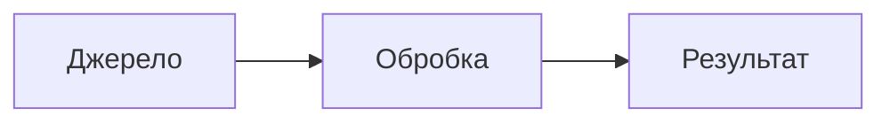
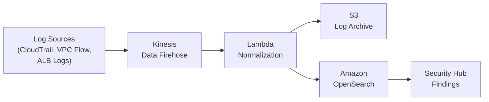

# note_skills.md — Стандарти написання конспектів лекцій (notes_NN.md)

> Цей файл є специфікацією для ШІ-агентів, що створюють або редагують файли `notes_NN.md` у цьому репозиторії.  
> Всі агенти зобов'язані точно дотримуватися цих вимог, щоб забезпечити однаковий академічний рівень у всіх конспектах.

---

## 1. Загальна характеристика конспекту лекції

Файл `notes_NN.md` — це **повноцінний академічний конспект** лекції, призначений як для самостійного вивчення студентами, так і для автоматичного заповнення панелі SLIDE_NOTES у `presentation_NN.html`.

**Розташування файлу:** `lectures/lecture-NN/notes_NN.md`

**Обсяг:** **9 000 – 12 000 слів** (≈ 60 000 – 80 000 символів). Менший обсяг свідчить про недостатню глибину розкриття теми.

**Мова:** Українська. Технічні терміни, абревіатури та назви сервісів (AWS CloudTrail, SIEM, MITRE ATT&CK тощо) залишаються в оригінальному написанні без перекладу.

---

## 2. Структура файлу notes_NN.md

```markdown
# Конспект лекції N: [Назва лекції]

**Курс:** Інформаційна безпека телекомунікаційних та хмарних технологій  
**Модуль N — Лекція N**

---

## 1. [Назва розділу]

[Текст розділу]

---

## 2. [Назва розділу]

[Текст розділу]

---

...

## 28. [Назва розділу]   ← орієнтовно 26–30 розділів

[Текст розділу]

---

## Підсумок

[Підсумковий текст лекції]
```

### Обов'язкові структурні елементи

- **Заголовок першого рівня** `# Конспект лекції N: Назва` — рівно один на початку файлу
- **Метадані** (`Курс`, `Модуль`) — одразу після заголовка
- **Горизонтальні роздільники** `---` між кожним розділом
- **26–30 нумерованих розділів** другого рівня `## N. Назва розділу`
- **Розділ "Підсумок"** — обов'язковий фінальний ненумерований розділ

---

## 3. Кожен розділ — вимоги до обсягу та змісту

### 3.1 Мінімальний обсяг одного розділу

- **Мінімум:** 250 слів (≈ 1 600 символів)
- **Оптимально:** 350–500 слів на розділ
- Розділ що містить лише маркований список без пояснень — **неприйнятний**

### 3.2 Обов'язкові елементи кожного розділу

1. **Вступний абзац** — визначення концепції або постановка проблеми (3–5 речень).
2. **Основний текст** — деталізований виклад механізмів, принципів, класифікацій.
3. **Таблиця порівняння** (де є порівнювальні об'єкти) — параметри/властивості.
4. **Приклад коду або конфігурації** (де технічно доречно) — блок ` ```yaml`, ` ```json`, ` ```hcl`, ` ```bash`.
5. **Заключний абзац** — практичні висновки, застосування в AWS або телеком-мережах.

### 3.3 Структура абзаців

- Кожен абзац містить **1–3 змістовних речення**, логічно пов'язаних між собою.
- Не допускається абзац з одним коротким реченням без пояснення.
- Причинно-наслідкові зв'язки мають бути явно виражені: "тому що", "що дозволяє", "у результаті чого", "це означає, що".

---

## 4. Академічний стиль викладу

### 4.1 Термінологія

- Перший раз вжитий технічний термін **супроводжується визначенням** у тому ж реченні або у наступному.
  - ✅ `UEBA (User and Entity Behavior Analytics) — система виявлення аномалій...`
  - ❌ `UEBA є системою виявлення аномалій.` (без розшифровки абревіатури)
- Якщо термін має загальновживану англійську назву, вона вказується в дужках при першому вживанні.

### 4.2 Посилання на стандарти та документи

Конспект **обов'язково** посилається на офіційні стандарти та документи у відповідних розділах:
- **PCI DSS** v4.0 (Requirement N) — для розділів про платіжну безпеку та логування
- **GDPR** (Article N) — для розділів про персональні дані
- **ISO 27001** (Annex A, Control N) — для розділів про управління безпекою
- **NIST SP 800-NN** — для розділів про архітектуру безпеки та криптографію
- **AWS Well-Architected Framework** (Security Pillar) — для AWS-розділів
- **GSMA FS.NN** — для телекомунікаційних розділів
- **3GPP TS NN.NNN** — для розділів про 5G та мобільні мережі
- **RFC NNNN** — для розділів про мережеві протоколи

### 4.3 Статистика та кількісні дані

Для підтвердження тверджень наводити **числові дані з джерелами**:
- Verizon Data Breach Investigations Report (DBIR)
- IBM Cost of a Data Breach Report
- Cloudflare DDoS Threat Report
- NETSCOUT Threat Intelligence Report
- Gartner Research

Формат посилання: `За даними [Джерело] [рік], [факт]` або `([Джерело], [рік])`.

### 4.4 Порівняльні таблиці

Таблиці оформлюються у **стандартному Markdown** з одинарними `|` роздільниками:

```markdown
| Параметр | Значення A | Значення B |
|----------|-----------|-----------|
| ...      | ...       | ...       |
```

- **Не** використовувати подвійні `||` або HTML-теги `<table>` у notes_NN.md
- Кожна таблиця має заголовки у першому рядку та роздільний рядок `|---|---|`
- Максимальна ширина стовпця — щоб таблиця читалась без горизонтальної прокрутки

---

## 5. Блоки коду

### 5.1 Дозволені мови для блоків коду

| Мова | Тег | Використання |
|------|-----|-------------|
| YAML | ` ```yaml ` | Конфігурації Kubernetes, Ansible, AWS CloudFormation |
| JSON | ` ```json ` | Структури даних, API-відповіді, IAM-політики |
| HCL | ` ```hcl ` | Terraform-конфігурації |
| Bash/Shell | ` ```bash ` | AWS CLI команди, скрипти |
| Python | ` ```python ` | Lambda-функції, автоматизація |
| SQL | ` ```sql ` | Athena-запити, аналіз логів |
| Sigma | ` ```yaml ` | Sigma Rules для виявлення загроз |

### 5.2 Правила оформлення коду

- Блоки коду мають бути **функціонально коректними** — не псевдокод
- Обов'язкові коментарі у складних блоках (`# коментар` або `// коментар`)
- Terraform-блоки мають відображати реалістичні назви ресурсів
- CLI-команди мають включати всі необхідні параметри

### 5.3 Приклад коректного блоку коду

```yaml
# AWS IAM Policy — Least Privilege для S3 Read-Only
resource "aws_iam_policy" "s3_read_only" {
  name = "s3-logs-read-only"
  policy = jsonencode({
    Version = "2012-10-17"
    Statement = [{
      Effect   = "Allow"
      Action   = ["s3:GetObject", "s3:ListBucket"]
      Resource = ["arn:aws:s3:::my-logs-bucket/*"]
    }]
  })
}
```

---

## 6. Mermaid.js — діаграми та схеми

### 6.1 Дозвіл на використання

Файли `notes_NN.md` **можуть та мають** використовувати `mermaid.js` для відображення:
- Архітектурних схем та потоків даних
- Послідовностей дій (Sequence Diagram)
- Дерев рішень та станових машин
- Ієрархій компонентів

### 6.2 Синтаксис блоку Mermaid

````markdown

````

### 6.3 Типи діаграм та їх використання

| Тип | Синтаксис | Коли використовувати |
|-----|-----------|---------------------|
| Потокова діаграма | `graph LR` / `graph TD` | Архітектурні потоки, pipeline |
| Діаграма послідовності | `sequenceDiagram` | Протоколи, аутентифікація, attack chains |
| Статечна діаграма | `stateDiagram-v2` | Lifecycle ресурсів, стани інциденту |
| Діаграма класів | `classDiagram` | Ієрархії об'єктів, моделі безпеки |
| Діаграма Ганта | `gantt` | Таймлайн інциденту, phases |
| Кругова діаграма | `pie` | Статистика розподілу |

### 6.4 Приклад архітектурної діаграми



### 6.5 Вимоги до діаграм

- Кожна діаграма повинна бути **зрозумілою без пояснення** — використовувати описові підписи вузлів
- Після блоку mermaid завжди слідує **абзац-пояснення** схеми
- Не використовувати діаграму замість тексту — вона є **доповненням** до текстового опису
- Максимум 2–6 діаграми на весь файл `notes_NN.md`

---

## 7. Вимоги до розкриття теми

### 7.1 Телекомунікаційний контекст (обов'язково)

Оскільки курс — "Інформаційна безпека телекомунікаційних та хмарних технологій", **кожна лекція** обов'язково включає **1–2 розділи** з явним фокусом на телекомунікаційну галузь:

- Специфіка застосування концепції в телеком-мережах (SS7, Diameter, SIP, 5G)
- Особливості загроз для телеком-операторів та ISP
- Регуляторні вимоги специфічні для телекому (GSMA, ETSI, 3GPP, ITU-T)
- Архітектура захисту в контексті 5G Core (AMF, SMF, UDM, SEPP)

### 7.2 AWS-контекст (обов'язково)

Кожна лекція обов'язково включає **3–5 розділів** з детальним описом AWS-сервісів:

- Назви конкретних сервісів (AWS GuardDuty, AWS Shield, AWS WAF, Amazon Macie тощо)
- Архітектура сервісів та взаємодія між ними
- Практичні команди AWS CLI або Terraform-конфігурації
- Порівняльні таблиці сервісів за параметрами
- Посилання на AWS Well-Architected Framework

### 7.3 Практичний кейс (обов'язково)

Кожна лекція включає **розділ "Практичний кейс"** з реалістичним сценарієм:

- Хронологія реальної або правдоподібної атаки / інциденту
- Таблиця з Час → Подія → Виявлення
- Опис технічних заходів виявлення та реагування
- Показники ефективності (MTTD, MTTR)

### 7.4 Типові помилки та чеклист (обов'язково)

Кожна лекція включає **розділ "Типові помилки та чеклист"**:

- Таблиця антипатернів: `| Антипатерн | Наслідок | Рішення |`
- Мінімум 6–9 пунктів антипатернів
- Чеклист з позначками `☑` — готові для копіювання в презентацію

### 7.5 Підсумок (обов'язково)

Фінальний розділ `## Підсумок`:

- **Обсяг:** 400–600 слів
- Синтез всіх ключових концепцій лекції
- Зв'язок між компонентами системи (чому важлива інтеграція)
- Compliance-аспект (PCI DSS, GDPR, ISO 27001, NIS2)
- Телеком-специфіка (якщо не виділена окремо)

---

## 8. Форматування Markdown

### 8.1 Заголовки

- `# H1` — тільки один, на початку файлу
- `## H2` — розділи (нумеровані: `## 1.`, `## 2.`)
- `### H3` — підрозділи всередині розділу (якщо потрібно)
- `#### H4` — рідко, лише для дуже глибокої ієрархії

### 8.2 Списки

- Маркований список: `- елемент` (дефіс зі пробілом)
- Нумерований список: `1. елемент`
- Не використовувати `*` для маркерів (тільки `-`)
- Вкладеність максимум 2 рівні

### 8.3 Виділення тексту

- **Жирний** `**текст**` — для ключових термінів та назв сервісів при першому вживанні
- *Курсив* `*текст*` — для назв документів, стандартів та книг
- `` `код` `` — для технічних рядків, команд, імен параметрів, назв файлів
- Не зловживати виділенням — не більше 2–3 виділень на абзац

### 8.4 Горизонтальні роздільники

Використовувати `---` між **кожним** розділом `## H2`. Не ставити роздільник перед першим розділом після метаданих.

---

## 9. Відповідність між notes_NN.md та презентацією

### 9.1 Структурна відповідність

- Кількість розділів `## N.` у `notes_NN.md` **приблизно відповідає** кількості змістових слайдів у `presentation_NN.html`
- Назви розділів мають семантично збігатися з назвами відповідних слайдів
- Розділ `## 1.` → Слайд 3 (перший змістовий, після титульного та плану)

### 9.2 Вміст SLIDE_NOTES береться з notes_NN.md

При генерації `SLIDE_NOTES` в `presentation_NN.html`:
- Беремо перший і другий абзаци відповідного розділу notes_NN.md
- Якщо розділ охоплює 2 слайди — перша половина → перший слайд, друга → другий
- При конвертації Markdown → HTML: `**bold**` → `<strong>`, `*italic*` → `<em>`, таблиці → `<table>`
- **КРИТИЧНО:** замінити `${` на `\${` у всьому HTML-тексті SLIDE_NOTES

### 9.3 Що НЕ потрібно синхронізувати

- Блоки коду в notes_NN.md **не обов'язково** відображати у SLIDE_NOTES (вони займають багато місця)
- Довгі таблиці у notes_NN.md можна скорочувати для SLIDE_NOTES (залишати 3–4 рядки)
- Mermaid-діаграми у notes_NN.md **не відображаються** у SLIDE_NOTES (замінити на текстовий опис)

---

## 10. Чеклист якості notes_NN.md

Перед збереженням файлу перевірити:

- [ ] Загальний обсяг: **9 000 – 12 000 слів** (перевіряти `wc -w notes_NN.md`)
- [ ] Є заголовок `# Конспект лекції N:` та метадані
- [ ] Є 26–30 нумерованих розділів `## N.`
- [ ] Є фінальний розділ `## Підсумок` (400–600 слів)
- [ ] Кожен розділ починається з вступного абзацу (≥3 речень)
- [ ] Присутні таблиці Markdown (мінімум 5 на весь файл)
- [ ] Присутні блоки коду (мінімум 3 на весь файл)
- [ ] Є розділ з телекомунікаційним контекстом (SS7/5G/SIP)
- [ ] Є розділ "Практичний кейс"
- [ ] Є розділ "Типові помилки та чеклист"
- [ ] Посилання на стандарти (PCI DSS, GDPR або ISO 27001)
- [ ] Горизонтальні роздільники `---` між розділами
- [ ] Таблиці оформлені з одинарними `|` (без `||`)
- [ ] Якщо використано Mermaid — після кожної діаграми є абзац-пояснення
- [ ] Немає плагіату та повторення цілих абзаців між розділами

---

## 11. Приклад структури одного розділу (еталон)

```markdown
## 5. SIEM: Security Information and Event Management

SIEM (Security Information and Event Management) є центральним компонентом будь-якого зрілого SOC і виконує функцію «мозку» системи безпеки, агрегуючи, кореляціюючи та аналізуючи події безпеки з усього середовища в режимі реального часу. Концепція SIEM виникла на початку 2000-х років шляхом поєднання Security Information Management (SIM) та Security Event Management (SEM), і відтоді пройшла чотири покоління еволюції.

Функціональна архітектура сучасного SIEM включає шість ключових компонентів. **Збір даних** (Data Collection) — прийом та парсинг логів із сотень різнорідних джерел. **Нормалізація** (Normalization) — приведення різноформатних подій до єдиної схеми. **Зберігання** (Storage) — індексований рушій OpenSearch для оперативного доступу. **Кореляція** (Correlation) — застосування правил виявлення до потоку подій. **Alerting** — пріоритизована генерація сповіщень. **Reporting** — автоматична генерація звітів для compliance.

| Сервіс | Роль у SIEM-стеку AWS |
|--------|----------------------|
| CloudTrail | Джерело IAM/API подій |
| GuardDuty | ML-детектор аномалій |
| Security Hub | Агрегатор findings |
| OpenSearch Service | SIEM-рушій, пошук, дашборди |
| EventBridge | Маршрутизація та тригери |
| Lambda | SOAR playbook виконання |

Популярні SIEM-платформи поділяються на три категорії: класичні enterprise (Splunk, IBM QRadar, Microsoft Sentinel), open-source (Elastic SIEM, Wazuh) та cloud-native (AWS Security Hub + OpenSearch). Ключовою метрикою ефективності SIEM є **False Positive Rate** — відсоток хибних спрацьовувань. За даними досліджень, аналітики SOC ігнорують до 44% алертів через їх надмірну кількість, що безпосередньо загрожує пропуском реальних інцидентів.

---
```

---

## 12. Заборони (що категорично не допускається)

- ❌ Загальні фрази без конкретики: "це дуже важливо", "дана технологія є корисною"
- ❌ Розділ тільки зі списком без пояснювального тексту
- ❌ Одноречечні абзаци як основний текст
- ❌ Відсутність будь-яких таблиць у всьому файлі
- ❌ Відсутність будь-яких блоків коду у всьому файлі
- ❌ Обсяг менший за 9 000 слів
- ❌ Відсутність посилань на хоча б один офіційний стандарт
- ❌ Використання `||` у таблицях Markdown
- ❌ Відсутність розділу "Підсумок"
- ❌ Mermaid-діаграма без наступного абзацу-пояснення
